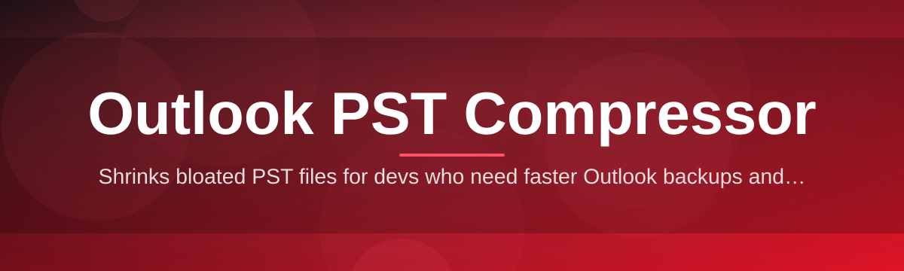

# outlook-pst-compressor-utility 📦🗜️

  

*A no-nonsense utility that shrinks bloated Outlook PST files back down to something your hard drive can respect.*

  

## 🧭 Overview

Anyone who has managed an Outlook mailbox for more than a year knows the slow creep: attachments pile up, deleted items linger in phantom folders, and the PST file quietly balloons until Outlook itself starts groaning on launch. **outlook-pst-compressor-utility** exists because that creep shouldn't be a permanent tax on your storage or your patience. It's a focused, standalone Windows tool built specifically to analyze, defragment, and compact PST archives — turning sluggish, oversized data files into lean, fast-loading containers without touching the integrity of a single email.

This isn't a general-purpose disk cleaner wearing a mail icon. Every routine in this project understands the internal PST structure — the B-tree indexing, the allocation tables, the way Outlook marks items as deleted but never actually reclaims the space. That domain-specific knowledge is what lets this Outlook PST Compressor recover space that generic "optimize" buttons inside Outlook itself simply leave behind.

It's built for IT administrators managing dozens of archived mailboxes, power users with a decade of email history refusing to let go of a single thread, and anyone whose `.pst` file has quietly become larger than their entire OS install. If you've ever watched Outlook hang for ten seconds just to open the inbox, this tool was written with that exact frustration in mind.

---

## 🎯 What Actually Sucked (And What Fixes It)

> [!NOTE]
> Outlook's built-in "Compact Now" feature is slow, opaque, and often fails silently on large files. This project was born directly out of that frustration.

Before this utility existed, dealing with an oversized PST meant one of three bad options: waiting through Outlook's native compaction (which stalls indefinitely on multi-gigabyte files), manually exporting and re-importing every folder, or just living with the bloat. None of those are acceptable in 2026. Here's what changed:

- **Deep structural scanning** — instead of guessing where space is wasted, the utility maps the PST's internal allocation table directly, pinpointing exactly which blocks are reclaimable before touching anything.

- **Non-destructive compaction passes** — the compression engine works on a shadow copy first, so a power loss or crash mid-process never leaves your original archive corrupted or half-written.

- **Batch processing for multiple mailboxes** — point it at a folder of `.pst` files and let it queue through all of them sequentially, which matters a lot if you're an admin cleaning up ten years of departed employees' archives.

- **Attachment-aware analysis** — it identifies which folders are actually responsible for the bloat (usually one "Sent Items" folder from 2019 full of forgotten PDFs) so you know where the weight is really coming from.

- **Orphaned-record purging** — Outlook marks deleted items as "soft deleted" internally but rarely removes them; this utility actually reclaims that dead weight during compaction.

- **Progress transparency** — a real-time progress readout with block counts and estimated size reduction, rather than a spinning wheel with zero feedback.

- **Zero telemetry, zero cloud round-trip** — compression happens entirely on your machine. Your mail never leaves your disk.

- **Portable, single-executable design** — no installer wizard, no registry sprawl, no background services quietly running after you're done.

---

## 🚀 Up and Running

Getting started takes about ninety seconds — no dependency chasing, no configuration files to hand-edit.

1. Visit the landing page and grab the latest build using the download button above (or below).

2. Run the executable directly — no installer, no setup wizard, no admin rights required for typical use.

3. Point it at your `.pst` file (Outlook should be closed first — see the Troubleshooting section).

4. Hit **Analyze**, review the projected space savings, then hit **Compact** and let it finish.

> [!TIP]
> Run the analysis pass first without committing to compaction. It gives you an honest before/after size estimate so there are no surprises.

---

## 🖥️ System Requirements

| Requirement | Details |
|---|---|
| OS | Windows 10 (64-bit) or Windows 11 |
| Outlook | Any modern desktop version supporting `.pst` files |
| Disk space | Free space roughly equal to the PST file size (for the shadow copy) |
| Dependencies | None — fully standalone, no runtime installs |
| Admin rights | Not required for standard local files |

  

---

## ⚙️ How It Works

The compaction pipeline follows a deliberate, cautious sequence rather than brute-forcing the file in place. Under the hood:

1. **Lock check** — confirms Outlook has released the file handle so nothing is writing to it mid-scan.

2. **Structural scan** — walks the PST's internal B-tree to map allocated vs. reclaimable blocks.

3. **Shadow copy** — compaction runs against a temporary working copy, never the original directly.

4. **Rebuild pass** — reconstructs the file with dead space stripped and indexes rebuilt cleanly.

5. **Atomic swap** — the original is only replaced once the rebuilt file passes an integrity check.

> [!IMPORTANT]
> The atomic swap step means your original file is never overwritten until the new, compacted version has already been verified. If verification fails, nothing changes.

---

## 🧩 Troubleshooting

<strong>Outlook won't let go of the PST file — "file in use" error</strong>

Close Outlook completely, including any background process still running in the system tray. On some setups, Outlook keeps a handle open for a few seconds after the window closes — wait five seconds and retry.

<strong>The tool reports almost no space savings on a huge file</strong>

If the PST was compacted recently, or if the bloat is from currently-active large attachments rather than deleted item residue, there may genuinely be little dead space to reclaim. Run the analysis pass to see the breakdown by folder.

<strong>Compaction seems to hang at a specific percentage</strong>

Very large files (10GB+) with heavy fragmentation can take a long time on the rebuild pass — this is disk I/O bound, not frozen. Give it time; the progress bar updates in chunks, not continuously.

<strong>Can I compress a PST that's password-protected?</strong>

Yes — you'll be prompted for the password before the scan begins. The password itself is never stored or logged anywhere.

<strong>Does this work on Exchange-connected OST files too?</strong>

No — OST files are cache files tied to a live Exchange/M365 mailbox and shouldn't be manually compacted this way. This utility is scoped specifically to `.pst` archive files.

<strong>My antivirus flagged the executable</strong>

This happens occasionally with unsigned utilities that perform low-level file rewriting. Verify you downloaded it from the official landing page linked in this README before whitelisting.

---

## 🎨 UI / UX Details

The interface leans intentionally minimal — this is a utility, not a dashboard.

- **Keyboard shortcuts**: `Ctrl+O` to open a file, `Ctrl+Enter` to start compaction, `Esc` to cancel a running job safely.

- **Themes**: Light and Dark modes, auto-switching based on Windows system theme by default.

- **Settings panel**: toggle shadow-copy location, adjust verification strictness, and set a default folder for batch scans.

- **Notification behavior**: a subtle toast on completion rather than an intrusive modal — you can keep working while it finishes.

> [!WARNING]
> Avoid interrupting a compaction job via Task Manager rather than the built-in Cancel button — abrupt termination can leave the shadow copy orphaned on disk (harmless, but it'll waste space until manually deleted).

---

## 🤝 Contributing & Community

Bug reports, feature requests, and pull requests are genuinely welcome — this project grew from real mailbox horror stories, and it keeps improving because people share theirs.

> Before opening an issue, please include your PST file size, Outlook version, and whether the file is password-protected — it cuts debugging time dramatically.

- Open an issue for bugs or edge cases you hit in the wild.
- Submit a pull request for fixes, translations, or performance improvements.
- Star the repository if this saved you from a bloated inbox — it genuinely helps visibility.

---

## 📄 License

Released under the [MIT License](LICENSE), 2026.

---

## ⚖️ Disclaimer

This tool is provided as-is, without warranty of any kind. Always maintain a backup of your PST file before running any compaction utility — while the shadow-copy and atomic-swap design is built to be safe, no third-party mail utility should ever be your only line of defense against data loss.

